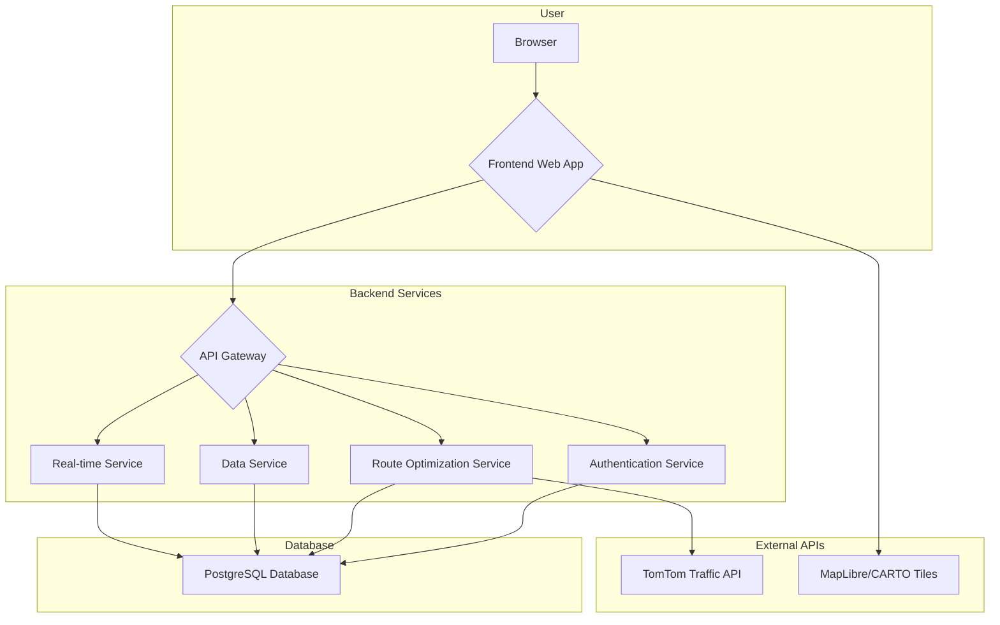

# Architecture Specification: Route Planning Web Application

**Author:** Manus AI
**Date:** January 7, 2026

## 1. Introduction

This document outlines the software architecture for a web-based route planning and optimization application. The project aims to create a clone of the core functionalities of the Route4Me route planning tool, with a focus on flawless route optimization, real-time traffic integration, and a modern user interface. The technical direction is guided by the user's request to utilize a Waze-like real-time traffic data source and a UI based on the MapCN design framework.

This specification details the proposed system architecture, technology stack, data model, and key components required to build a scalable, reliable, and feature-rich application.

## 2. System Architecture Overview

The application will be designed using a microservices-oriented architecture to ensure scalability, maintainability, and separation of concerns. The system is composed of a frontend web application, a backend API gateway, several specialized backend services, a central database, and integrations with external APIs for mapping and traffic data.

### High-Level Architecture Diagram

### Component Responsibilities

| Component | Description |
| :--- | :--- |
| **Frontend Web App** | The single-page application (SPA) that users interact with. It will be responsible for rendering the user interface, including the interactive map, forms for route planning, and data visualization dashboards. |
| **API Gateway** | The single entry point for all frontend requests. It will route requests to the appropriate backend microservice and handle cross-cutting concerns like authentication and rate limiting. |
| **Authentication Service** | Manages user registration, login, session management, and API key security. |
| **Route Optimization Service** | The core of the application. This service will contain the complex logic for route optimization, taking into account various constraints and real-time traffic data. |
| **Data Service** | Provides CRUD (Create, Read, Update, Delete) operations for all application data, such as routes, stops, users, and vehicles. |
| **Real-time Service** | Manages real-time communication using WebSockets for features like live driver tracking and instant notifications. |
| **PostgreSQL Database** | The primary data store for the application. The PostGIS extension will be used for efficient geospatial queries. |
| **External APIs** | Third-party services for map tiles (CARTO) and real-time traffic data (TomTom). |

## 3. Frontend Architecture

The frontend will be a modern, responsive single-page application designed for a seamless user experience.

- **Framework:** **React** with **TypeScript** for type safety and robust component development.
- **UI Components:** **shadcn/ui** will be used for the base component library, ensuring a consistent and accessible design system. The **MapCN** library will be used for all map-related components, as requested [1].
- **Styling:** **Tailwind CSS** will be used for a utility-first styling approach, allowing for rapid and consistent UI development.
- **Map Library:** **MapLibre GL JS**, the underlying library for MapCN, will provide the core mapping functionality. Basemaps will be sourced from **CARTO's free tile service**, which requires no API key.
- **State Management:** **Zustand** will be used for global state management due to its simplicity and minimal boilerplate compared to Redux.

## 4. Backend Architecture

The backend will be built with Node.js and TypeScript, following a microservices pattern to ensure scalability and maintainability.

- **Framework:** **NestJS** will be the framework of choice for building the backend services. Its modular architecture, dependency injection system, and strong TypeScript support make it ideal for building scalable applications.
- **API Design:** A **RESTful API** will be exposed by the API Gateway for standard client-server communication. **WebSockets** will be used for real-time features.

### 4.1. Route Optimization Service

This is the most critical component of the system. It will expose an endpoint to accept a list of stops and a set of constraints, and will return one or more optimized routes.

- **Algorithm:** The service will implement a solution to the Traveling Salesperson Problem (TSP) and Vehicle Routing Problem (VRP). A metaheuristic algorithm like a **Tabu Search** or a **Simulated Annealing** algorithm is recommended for its ability to find near-optimal solutions for complex problems in a reasonable amount of time.
- **Traffic Integration:** The service will query the **TomTom Traffic API** to get real-time and historical traffic data. This data will be used to calculate travel times between stops, resulting in more accurate and realistic route optimization.

### 4.2. Real-time Traffic API

As per the research into cost-effective Waze-based alternatives, the **TomTom Traffic API** is the recommended choice [2].

- **Cost-Effectiveness:** TomTom offers a generous free tier of **2,500 API requests per day**, which is sufficient for development and early production stages.
- **Features:** The API provides real-time traffic flow, incident data, and historical traffic patterns, which are comparable to the data provided by Waze.
- **Implementation:** A dedicated module in the Route Optimization Service will be responsible for interacting with the TomTom API, caching results where appropriate to minimize API calls.

## 5. Data Model

A **PostgreSQL** database with the **PostGIS** extension is recommended. This provides strong relational integrity and powerful geospatial querying capabilities.

### Key Database Tables

| Table | Description |
| :--- | :--- |
| `users` | Stores user account information, including hashed passwords and API keys. |
| `routes` | Stores information about a planned route, including the optimization parameters used. |
| `stops` | Stores information about each stop on a route, including address, location (as a PostGIS geometry point), and service time. |
| `vehicles` | Stores information about the user's vehicles, including capacity and other constraints. |
| `optimizations` | Stores the input and output of each optimization request for historical analysis and debugging. |
| `tracking_history` | Stores the real-time location data of drivers for live tracking and reporting. |

## 6. Deployment and Operations

- **Containerization:** All backend services will be containerized using **Docker** for consistency across development, testing, and production environments.
- **Orchestration:** **Kubernetes** is recommended for orchestrating the containerized services in a production environment, providing automated scaling, and high availability.
- **CI/CD:** A CI/CD pipeline will be set up using **GitHub Actions** to automate testing and deployment.

## 7. References

[1] MapCN Documentation. (n.d.). Retrieved from https://mapcn.vercel.app/docs/installation
[2] TomTom Developer Portal. (n.d.). Traffic API. Retrieved from https://developer.tomtom.com/traffic-api
